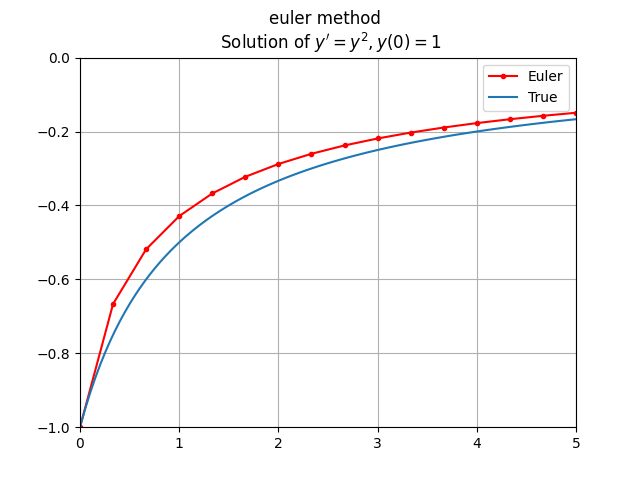
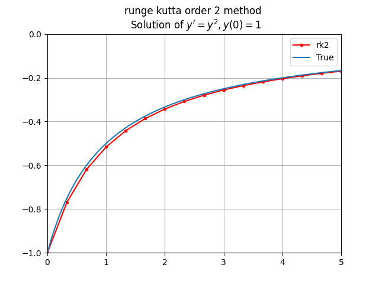
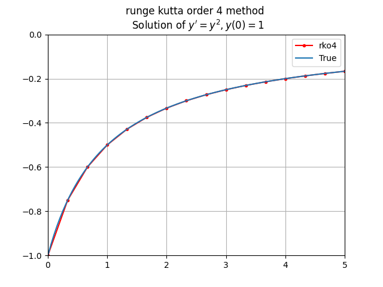
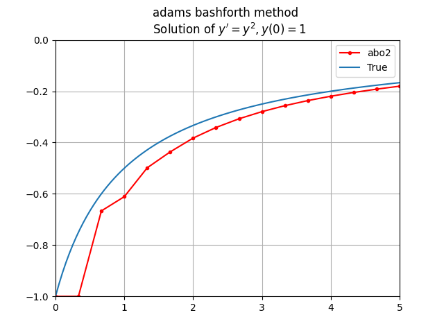
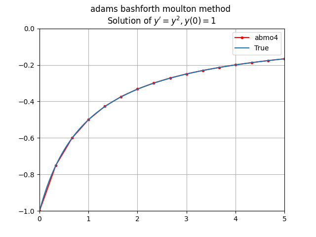

# Numerical solution of ordinary differential equations methods

### <font color="c5f015"><I> every method has been implement with one example

### <I> for equation ```y'=y^2 , y(0)=1```  with plot prediction and true value of function</font>

### How to use ?

each method implement in class with solve function <br>
for use import selected file following [main.py](main.py) <br>
and call constructor function with inputs, then just call solve function <br>
result will be return as array

### requirements ?
as you can see in [requirements](requirements.txt) file in repository only user numpy for calculate <br> 
and matplotlib for plot result and compare with true answer


## [euler method](src/euler_method/euler/euler.py):



## [runge kutta order 2](src/runge_kutta/second_order/rk2o.py)



## [runge kutta order 4](src/runge_kutta/forth_order/rk4o.py)



## [adams bashforth 2 step](src/adams_bashforth_2_step/adams_bashforth.py)



## [adams bashforth moulton](src/adams_bashforth_moulton/abmo4.py)



## repository tree :
```
.
├── README.md
├── images
│   ├── abmo4.png
│   ├── abo2.png
│   ├── euler.png
│   ├── rko2.png
│   └── rko4.png
├── main.py
├── requirements.txt
└── src
    ├── adams_bashforth_2_step
    │   └── adams_bashforth.py
    ├── adams_bashforth_moulton
    │   └── abmo4.py
    ├── euler_method
    │   └── euler
    │       └── euler.py
    └── runge_kutta
        ├── forth_order
        │   └── rk4o.py
        └── second_order
            └── rk2o.py

```